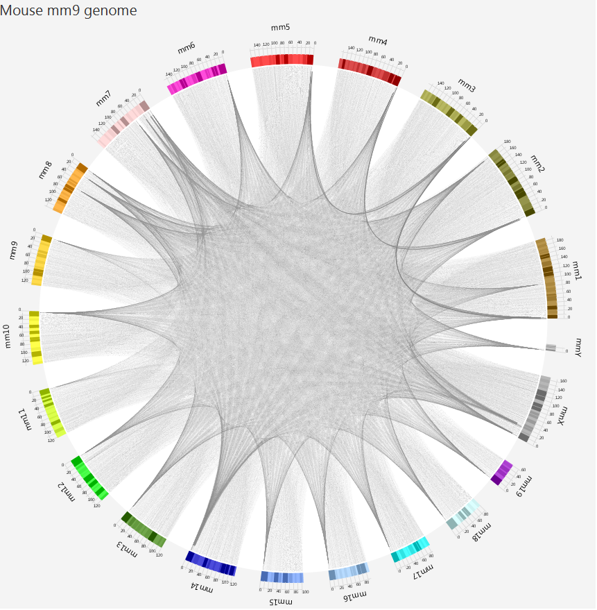
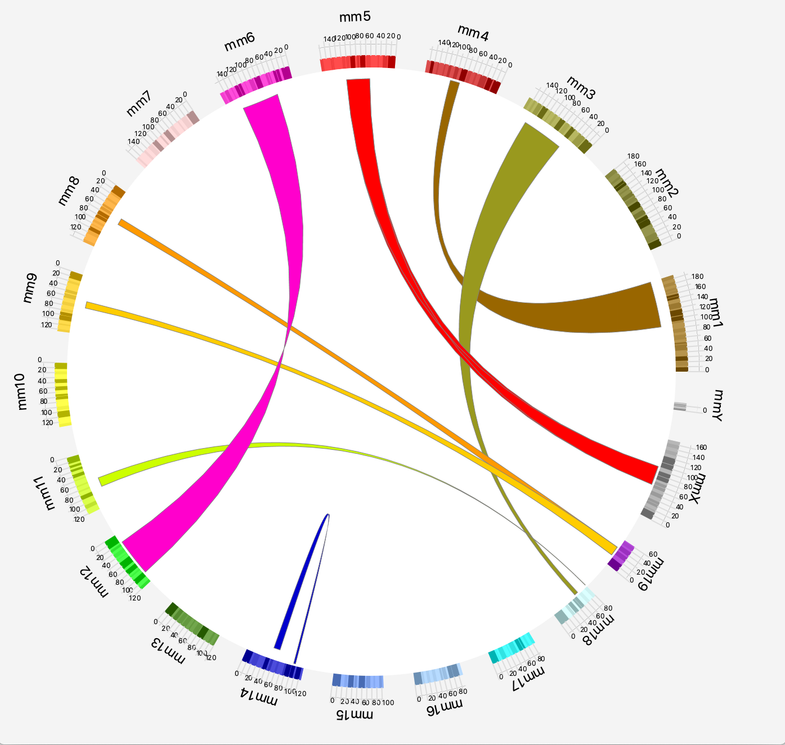

#CircosFX
Chord Diagram / Circos reimplementation in a Java (JavaFX) widget for GUI interface usage.

####Build and Test
This distribution includes Gradle for building and testing which is very easy to try.
Just use:

`./gradlew build`
[gradlew.bat on windows]

This will build a directory (build/libs) containing a jar package managing all needed dependencies.
 

`./gradlew test`  
this will trigger unit tests including some GUI integration tests that will also demonstrate you some 
of the package capabilities. 

####_Licensing_
I allow this work to be used free of charge under the license below but I _require_ that you notify me 
dropping a message using my linkedin profile for whatever use you do of the software.

I have licensed my work with GPLv2. I know this is quite restrictive and I'm evaluating different solutions. 
So, if you have different needs, feel free to contact me.
